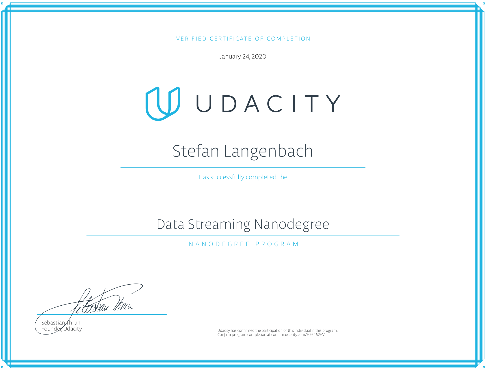

# Data Streaming Nanodegree
This repo contains all materials of Udacity's data streaming nanodegree.

It is structured around the following projects:
1. [Optimizing Chicago public transport with Apache Kafka](https://github.com/slangenbach/udacity-ds-nanodegree/tree/master/traffic_optimization)
2. [Analyzing San Francisco crime statistics with Spark Structured Streaming](https://github.com/slangenbach/udacity-ds-nanodegree/tree/master/crime_statistics)

